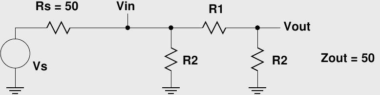

# maxima-circuits
Maxima functions for circuit calculations

See also the accompanying [Hackaday article](https://hackaday.com/2019/02/28/computer-algebra-for-electronic-design/).

# Usage
Load the functions using

    load("circuits.mac")$
    
You may also place this line in your startup script (typically ~/.maxima/maxima-init.mac or ~/.maxima/wxmaxima-init.mac)

# par(...)
Calculate reciprical of sum of reciprocals of supplied arguments, aka the harmonic sum. This calculates equivalents for parallel resistor or inductor values, or for series capacitors.

Examples:

    (%i2) par(100, 75);
    (%o2)                          42.85714285714285

    (%i3) par(r1, r2, r3);
                                          1
    (%o3)                            ------------
                                     1    1    1
                                     -- + -- + --
                                     r3   r2   r1
# vdiv(r_top, r_bot)
Calculate output of a voltage divider as a ratio of the input voltage.

Examples:

    (%i4) 5*vdiv(75, 150);
    (%o4)                          3.333333333333333

    (%i5) vdiv(r1, r2) = 3.3/5;
                               r2
    (%o5)                    ------- = 0.6599999999999999
                             r2 + r1

# pref(x, E)
Find preferred values from EIA standard "E series." The following values for E are allowed:

    E3      : 50% tolerance
    E6      : 20% tolerance
    E12     : 10% tolerance
    E24     : 5% tolerance
    E48     : 2% tolerance
    E96     : 1% tolerance
    E192    : <1% tolerance
    E48_24  : combined vales from E48 and E24 series
    E96_24  : combined vales from E96 and E24 series
    E192_24 : combined vales from E192 and E24 series
    
Examples:

    (%i6) pref(50, E3);
    (%o6)                                47.0
    (%i7) pref(50, E24);
    (%o7)                                51.0
    (%i8) pref(50, E96);
    (%o8)                                49.9

# VrtodB(Vr)
Convert voltage ratio to dB

Example:

    (%i2) VrtodB(sqrt(2));
    (%o2)                          3.010299956639812
    
# dBtoVr(dB)
Convert dB to voltage ratio

Example:

    (%i6) dBtoVr(6);
    (%o6)                          1.995262314968879

# Comprehensive Example
Let's design a 6dB pi attenuator for a 50-ohm system. The circuit looks like this:

First, we write an expression for the output impedance:

    (%i14) Zout: par(r2, r1+par(r2, 50));
                                           1
    (%o14)                        -------------------
                                  1          1
                                  -- + --------------
                                  r2       1
                                       --------- + r1
                                       1
                                       -- + 0.02
                                       r2
                                       
next, an expression for the input to output voltage ratio (Vout/Vin):

    (%i15) Vout: vdiv(r1, par(r2, 50));
                                          1
    (%o15)                   ----------------------------
                                  1            1
                             (--------- + r1) (-- + 0.02)
                              1                r2
                              -- + 0.02
                              r2

Using these expressions, we create a system of two equations and solve for the resistor values:

    (%i3) soln: solve([Zout = 50, Vout = dBtoVr(-6)], [r1, r2]);
    (%o3) [[r1 = 37.35187703354015, r2 = 150.4760237537246], [r1 = 0, r2 = 0]]

The first solution is the one we're interested in. Now, we choose resistors from the E12 (10%) series:

    (%i4) vals: pref(first(soln), E12);
    (%o4)                       [r1 = 39.0, r2 = 150.0]

and evaluate the result:

    (%i5) ev([Zout, VrtodB(Vout)], vals);
    (%o5)              [50.66225165562914, - 6.192603348517975]
    
Let's see how much better 1% values are:

    (%i6) vals: pref(first(soln), E96);
    (%o6)                       [r1 = 37.4, r2 = 150.0]

How does this look?

    (%i7) ev([Zout, VrtodB(Vout)], vals);
    (%o7)              [49.95553579368609, - 6.009010999434952]

Close enough.

